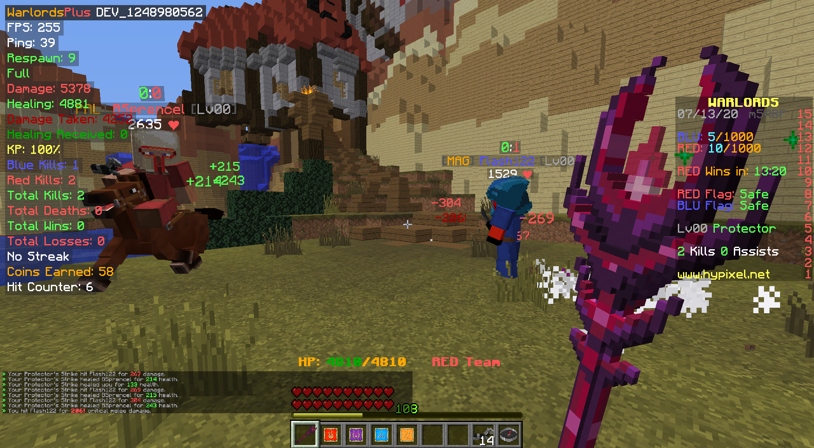
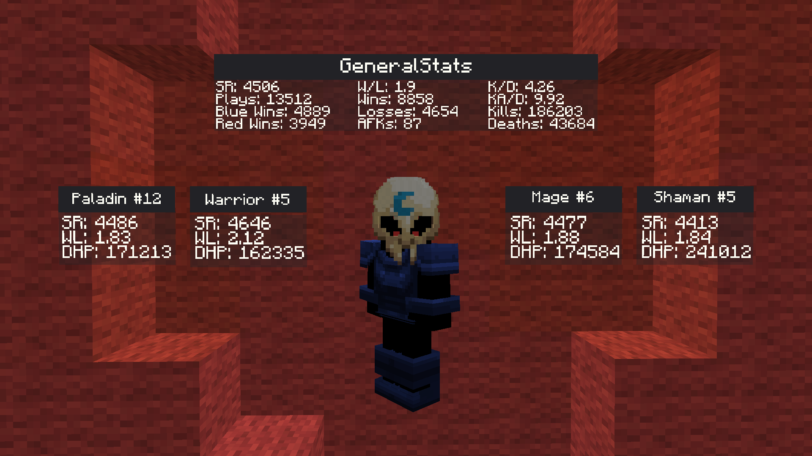
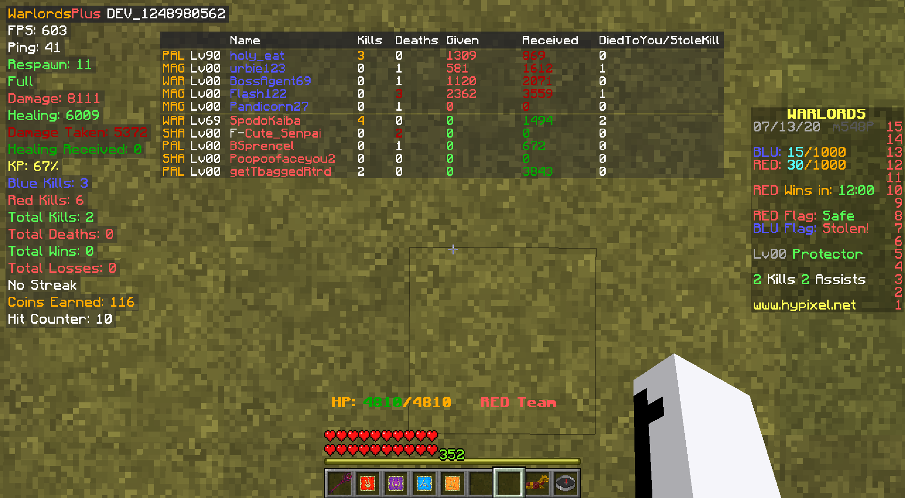
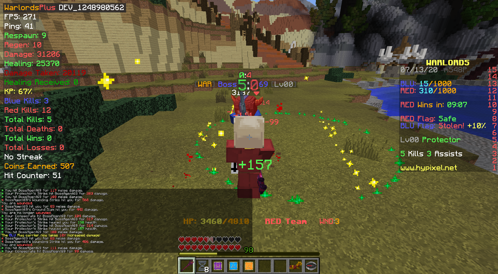

# [WARLORDS+]

> Hey, [@ebicep](https://github.com/ebicep) and [@unaussprechlich](https://github.com/unaussprechlich) have decided to create a new mod for warlords that adds a bunch of new features.

### Features
- Fps/Ping​
- Respawn Timer for CTF​
- Regen Timer​
- Damage, Healing, Damage Taken, Healing Taken Counter​
- Energy Given/Received/Stolen​
- Kill Participation ( KP = ( Your kills + Assists ) / total kills on your team )​
- Red and Blue kill counter​
- NEW TAB​
  - Show kills/deaths of each player
  - Shows Damage given/received from each enemy player
  - Shows Healing given/received from each team player
  - NOTE- Cuts out at bottom if there are too many players (Resizable later)​
- TOGGLE OPTIONS - Esc>Mod Options>WarlordsPlus>config

### Changelog

Can be found [HERE](https://github.com/unaussprechlich/warlordsplus/releases)

### Bugs & Issues

Report them [HERE](https://github.com/unaussprechlich/warlordsplus/issues)

### Setup Development Environment

1. Clone the repository
2. Run `forgegradle:setupDecompWorkspace`
3. Sync Gradle
4. Add a run configuration. For IntelliJ just specify an Application configuration, which does execute `GradleStart`  
   Set `--username=EMAIL` and `--password=PASSWORD` as CLI arguments  
   Set `-Dfml.coreMods.load=net.unaussprechlich.mixin.CoreMod` as VM option
5. Have fun